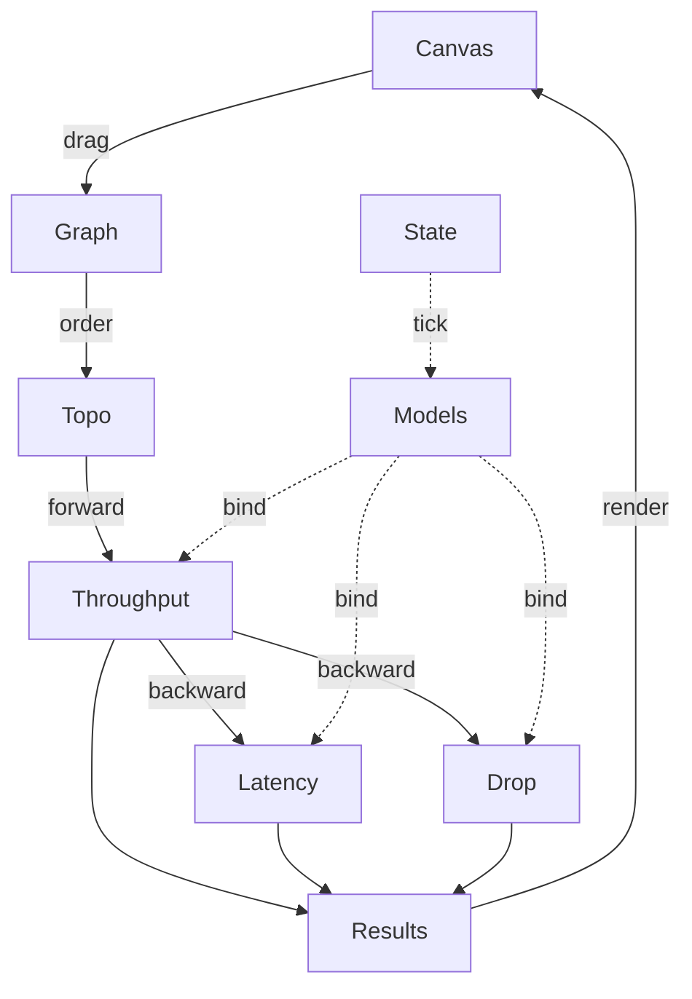
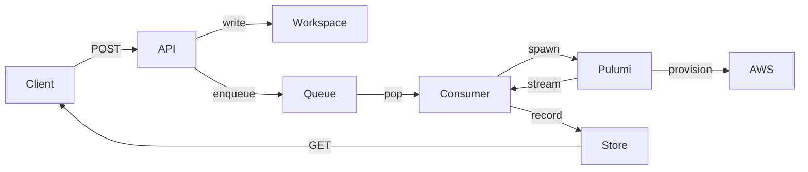

<div align="center">


# Argon

**Drag AWS services onto a canvas. Wire them. Watch throughput, latency and loss settle in real time.**

[](LICENSE)
[](https://www.typescriptlang.org/)
[](https://react.dev/)
[](https://www.python.org/)
[](https://fastapi.tiangolo.com/)
[](https://www.pulumi.com/)

[**Live demo**](https://REPLACE_WITH_DEPLOYED_URL) · [**Architecture**](docs/architecture.md) · [**Backend API**](backend/README.md)

</div>

## Why Argon

Cloud diagrams show boxes. They do not show what happens when traffic arrives.

Argon runs the diagram. Every second it computes three things. How many megabits each service serves. How long the slowest one percent of requests wait. How much traffic is lost. You see the bottleneck before your users do, and before your bill does.

Use it to size an Auto Scaling Group before launch day. Use it to check whether that Spot fleet is a brave idea or a bad one. Use it to teach how AWS behaves under load, with no account and no invoice.

## What you get

* Ten AWS services with real limits: EC2, ECS Fargate, Auto Scaling, ELB, SQS, Lambda, S3, CloudFront, Route 53 and Aurora.
* Three numbers per node per tick: throughput, p99 latency and drop rate.
* A model tier on every number. **Measured** comes from AWS documentation. **Estimated** is derived. **Assumed** is our best guess, and the node tells you so.
* Notes on each node that explain which limit bit you. Network credits ran out. CPU saturated. Spot took your instance back.
* A world map of AWS regions.
* JSON import and export for any graph you build.
* A backend that turns the design into real infrastructure with Pulumi, when you are ready to spend actual money.

> [!NOTE]
> Argon is a simulator. It models published quotas, measured percentiles and documented scaling behaviour. It does not call AWS to run a simulation.

## Quick start

> [!TIP]
> Open the [live demo](https://REPLACE_WITH_DEPLOYED_URL) to try the simulator with zero setup. Everything below is for running it yourself.

### Frontend

```sh
pnpm install
pnpm dev
```

Open `http://localhost:5173`.

### Backend, without Docker

```sh
cd backend
uv sync
uv run uvicorn main:app --app-dir src --reload
```

Open `http://localhost:8000/docs`.

> [!IMPORTANT]
> The simulator needs no AWS account. The Pulumi CLI and AWS credentials are needed only when you deploy a design through the backend.

### Backend, with Docker

```sh
docker build -t argon-backend backend
docker run -p 8000:8000 \
  -e AWS_ACCESS_KEY_ID -e AWS_SECRET_ACCESS_KEY -e AWS_REGION \
  argon-backend
```

The image already contains the Pulumi CLI.

## Ways to use it

**As an app.** Open the canvas. Drag services from the sidebar. Connect outputs to inputs. Press play. Adjust an instance type and watch the numbers move.

**As a library.** The math and the graph runtime have no UI dependency. Import them into your own tooling.

```ts
import { emptyGraph, addNode, connect, Runtime } from "#graph"
import { ServiceType } from "./src/types/math"

let graph = emptyGraph({ sourceMbps: 800 })
graph = addNode(graph, { id: "lb", service: ServiceType.LB, config: {} })
graph = addNode(graph, { id: "web", service: ServiceType.EC2, config: { instanceType: "t3.large" } })
graph = connect(graph, "lb", "web")

const runtime = new Runtime()
const results = runtime.step(graph)
console.log(results.get("web")?.throughput.servedMbps)
```

Run `step` in a loop to let credits drain and Auto Scaling groups react. Good for a capacity plan you can put in a spreadsheet instead of a slide.

**As a backend.** Two REST paths, both under `backend/`.

| Path | What it does |
| --- | --- |
| `POST /deployments/` | Deploys a typed design. Pick EC2 or App Runner, add CloudFront if you want. |
| `POST /runs/` | Deploys any Pulumi Python program you send. Argon runs `pulumi up` for you and streams the log. |

Both return a job you can poll. Both stay out of your way until you ask them to do something expensive.

**As a headless tool.** Every `/runs/` job leaves its Pulumi project on disk. `cd` into the folder and use the Pulumi CLI directly.

## Architecture

### Frontend



Each tick, the runtime sorts the graph from sources to sinks. The **throughput pass** walks forward. Each node serves `min(offered, capacity)` and splits the served traffic across its outputs. The **latency and drop pass** walks backward. Each node reads the p99 and the loss of everything downstream, then adds its own. Stateful models such as burst credits and scaling ramps advance exactly once per tick.

### Backend



A request writes Pulumi files into a scratch workspace and drops a job on a queue. A worker thread pops the job and starts `pulumi up` as a subprocess. It streams every output line into a status table keyed by workspace folder. You poll that table. The queue is a protocol, so an SQS queue can replace the in memory one without touching the worker.

> [!NOTE]
> Every result carries a model tier and a list of notes. When a number surprises you, the notes tell you which assumption produced it.

Read the full breakdown, with formulas, in [docs/architecture.md](docs/architecture.md).

## Configuration

| Setting | Where | Default | Purpose |
| --- | --- | --- | --- |
| `dtSeconds` | graph defaults | `1` | Simulated seconds per tick |
| `sourceMbps` | graph defaults | `100` | Traffic offered to nodes with no inputs |
| `avgBytes` | graph defaults or edge | model specific | Request size used to convert Mbps to requests per second |
| `PULUMI_BACKEND_URL` | backend env | `file://~` | Where Pulumi stores state |
| `PULUMI_BIN` | backend env | `pulumi` | Path to the Pulumi CLI |
| `RUNNER_WORKERS` | backend env | `1` | Concurrent `pulumi up` runs |

The full backend variable list is in [backend/README.md](backend/README.md).

## Project layout

```
src/math/        one folder per service: throughput, latency, drop
src/graph/       graph type, topological walk, runtime, React store
src/components/  canvas, nodes, frames, map
backend/src/     FastAPI app: agent/, deploy/, runner/
backend/tests/   pytest suite
docs/            architecture deep dive
```

## Development

```sh
pnpm lint
cd backend && uv run pytest --cov=src
```

The backend sits at 100 percent line coverage. The tests stand in for the Pulumi CLI with `/bin/true` and `/bin/false`. They are the two most reliable cloud providers we know.

## License

[MIT](LICENSE)
