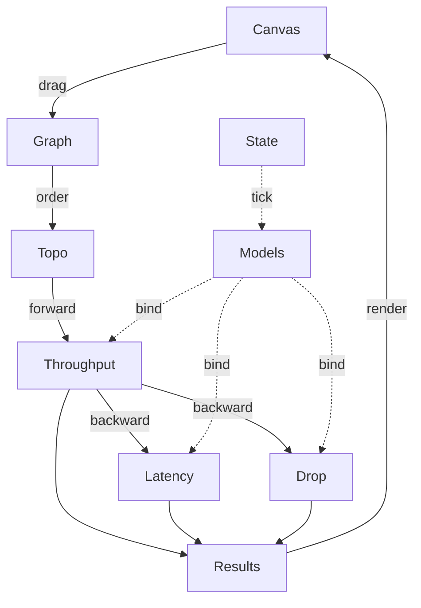
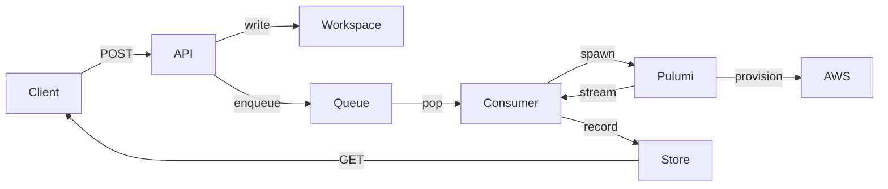

# Architecture

This document explains how Argon computes its numbers and how the backend turns a design into infrastructure. Read the [README](../README.md) first for the short version.

## Frontend



### Units and tiers

Every quantity carries its unit. The types live in `src/types/math.ts`.

| Type | Unit | Used for |
| --- | --- | --- |
| `Mbps` | megabits per second | all throughput |
| `Bytes` | bytes | request size |
| `Seconds` | seconds | tick length, burst duration |
| `Milliseconds` | milliseconds | all latency |
| `Ratio` | 0 to 1 | utilization, drop rate |

Throughput is always `Mbps`. Latency is always `Milliseconds`. `toMbps` and `toRps` convert between megabits and requests using a request size. The size comes from the edge, else from the node, else from a documented assumption.

Every result also carries a `ModelTier` and a list of `notes`.

| Tier | Meaning |
| --- | --- |
| `measured` | The number comes from AWS documentation or a published benchmark. |
| `estimated` | The number is derived from a measured one. Example: baseline bandwidth from vCPU count. |
| `assumed` | The number is our guess. The note says what we guessed. |

The tier is the honesty label. When a node says `assumed`, treat its output as a shape, not a fact.

### One tick, two passes

`Runtime.step(graph)` in `src/graph/walk.ts` runs once per tick.

1. Increment the tick counter.
2. Sort nodes with Kahn's algorithm (`topoOrder`). If a cycle blocks progress, pick any unvisited node and continue. Edges that point backward in the order are reported as back edges.
3. Drop cached bindings for nodes that left the graph.
4. **Forward pass**, sources to sinks. For each node, collect `inputsMbps` from each incoming edge. The value is the upstream node's `outputsMbps` at the index of that edge. A node with no inputs receives `defaults.sourceMbps`. Call the node's throughput function.
5. **Backward pass**, sinks to sources. For each node, collect `downstreamMs` (each downstream node's `tailMs`) and `downstreamDrop` (each downstream node's `dropRate`). Call the node's latency function, then its drop function.
6. Store the three results per node and return the map.

Bindings are cached per node. A binding holds the node's state object plus three closures, one per metric. The cache is invalidated when the `config` object identity changes. This keeps stateful models alive across ticks and rebuilds them the moment you change a dropdown.

> [!NOTE]
> Latency and drop only read the throughput state. They never advance it. The forward pass always runs first for that reason.

### Throughput

Each service exports a `ServiceModel` with `defaults`, `capacity(config)`, an optional `newState(config)`, and `evaluate(config, state)`. `evaluate` binds the config once and returns a function over the per tick context. The per tick function is a pipeline of pure steps from `src/math/utilities.ts`.

```
offered → cap → splitEven | splitWeighted → note → tier
```

* `offered` starts the result from the sum of `inputsMbps`.
* `cap(capacity)` sets `served = min(offered, capacity)`, `overflow = offered − served`, and `utilization = offered / capacity`.
* `splitEven(n)` divides `served` equally across `n` outputs. `splitWeighted(w)` divides by weight.
* `note(text)` appends an explanation when its condition is true.
* `tier(t)` stamps the model tier.

**EC2 example.** Capacity is the tighter of two limits.

* **NIC.** `instancetype.csv` gives burst bandwidth and, where AWS publishes it, baseline bandwidth. When baseline is missing, it is estimated as `burst × vCPU / 32`, capped at burst.
* **CPU.** `vCPU × threads × 1000 / processingMs` requests per second, converted to Mbps with the request size. `processingMs` is 5 ms and is an assumption.

If the CPU limit is lower than the NIC limit, the node is CPU bound. It says so in a note and drops to the `assumed` tier.

### Burst credits

EC2 and Fargate network bandwidth is burstable. `creditBucket` models the bucket.

```
bucketMax = (burst − baseline) × burstSeconds
available = credits > 0 ? burst : baseline
used      = min(demand, available)
credits   = clamp(credits + (baseline − used) × dt, 0, bucketMax)
```

Credits refill when demand is below baseline and drain when demand is above it. The bucket advances once per tick. A second call in the same tick returns the same grant. When the bucket hits zero, the node drops to baseline. A note tells you why your throughput dropped after thirty minutes.

### Autoscaling ramp

Auto Scaling Groups and Fargate services scale with `ramp()`. A `RampSpec` describes the group.

| Field | Meaning | ASG value |
| --- | --- | --- |
| `floor`, `ceiling` | min and max size | from config |
| `delayUpS` | sustained demand before scale out | 180 s |
| `launchS` | time until new capacity serves traffic | 240 s |
| `delayDownS` | sustained low demand before scale in | 900 s |
| `cooldownS` | minimum gap between scaling actions | 300 s |

Each tick, the desired count is computed from target utilization: `ceil(level × utilization / target)`. The ramp tracks how long demand has stayed above or below target. When the delay and the cooldown are both satisfied, it orders capacity. Ordered capacity sits in a pending list until `launchS` elapses, then joins the level. Scale in is immediate once its delay passes.

This is why an ASG in Argon takes about seven minutes to help you. AWS does the same.

### Latency

Latency is p99 by default. Where a service queues requests, the model is M/M/c.

```
ρ       = λ / (c × μ)
P(wait) = Erlang C(c, λ / μ)
p99     = ln(P(wait) / 0.01) / (c × μ − λ)
```

`λ` is arrivals per second from offered throughput and request size. `μ` is service rate per server. `c` is the number of servers, for example CPU threads on EC2. When `ρ ≥ 1` the queue is unstable and p99 is infinite. `capTimeout` then replaces it with the documented client timeout.

The latency pipeline mirrors the throughput one.

```
start → wait → mix → downstream → capTimeout
```

* `start(serviceMs)` sets the base service time.
* `wait(mmc(...))` adds queueing delay.
* `mix(branches)` combines parallel paths. p50 is the weighted mean. p99 is the slowest branch that carries at least one percent of traffic (`tailMix`).
* `downstream(p99)` adds the downstream p99. Only p99 is known downstream, so p50 stays the node's own.
* `capTimeout(t)` clamps p99 to a documented timeout and adds a note.

Where AWS publishes percentiles, the model uses them directly. SQS standard queues use a measured p50 of 16.2 ms and p99 of 105 ms. Lambda is bimodal. p99 becomes the cold start time as soon as one percent of invocations are cold.

### Drop

Drop is the fraction of offered traffic that does not arrive. Causes are independent and combine as

```
dropRate = 1 − Π (1 − rᵢ)
```

| `DropKind` | Source |
| --- | --- |
| `overflow` | offered exceeded capacity |
| `throttle` | a quota refused the request |
| `timeout` | latency exceeded the client timeout |
| `refused` | the service refused the connection |
| `unavailable` | the service was down |
| `reclaimed` | Spot took the instance |
| `downstream` | a node further along dropped it |

Two helpers refine a raw drop rate.

* `retried(d, R)` returns `d^(R+1)`, the chance all attempts fail. AWS SDKs retry twice. Browsers do not retry.
* `tailExceed(p99, timeout)` returns `0.01^(timeout / p99)`, the chance a request outlives its timeout, from the exponential tail anchored at p99.

**EC2 example.** `overflow` is `1 − served / offered`. `reclaimed` is a floor for Spot instances: five percent interruptions per month times a 300 second replacement window, spread over the month. On Demand and Reserved plans have no reclaim floor.

### Frontend state

`GraphStore` in `src/graph/store.ts` holds the graph and notifies React through `useSyncExternalStore`. Nodes call `useNodeConfig(service, defaults, id)` on mount. That registers the node in the graph with its defaults and returns a patch function for the node's controls. Unmounting removes the node and its edges.

`useSimulation(running, hz)` owns a `Runtime` and calls `step` on an interval. Components read results from the returned map by node id.

## Backend



The backend is a FastAPI app in `backend/src/` with three modules. Each module has the same shape: `router → dependencies → service → schemas`.

### `deploy/`, the typed path

`POST /deployments/` takes a target (`ec2` or `apprunner`), its options, and a `cloudfront` flag. The service builds a Pulumi program in Python from `deploy/pulumi/` and runs it through the Pulumi Automation API in process. The request returns `202` at once. A background task runs `up` and records `succeeded` with outputs, or `failed` with the error. `DELETE` runs `destroy` on the same stack.

### `runner/`, the freeform path

`POST /runs/` takes a map of filenames to file contents. It must include `__main__.py`.

1. `workspace.create_workspace` makes a scratch folder under `RUNNER_ROOT`. The folder name is the job's key.
2. `workspace.write_files` writes each file. Names with `/`, `\`, `..` or a leading `~` are refused.
3. `workspace.ensure_project_file` writes a `Pulumi.yaml` when you did not send one.
4. `process.start_pulumi_up` builds a `PulumiJob`: command, environment and working directory. It does **not** start the process.
5. The job goes on the `JobQueue`. `InMemoryJobQueue` wraps `queue.Queue`. The protocol is three methods, so an SQS queue can replace it.
6. A `Consumer` worker thread pops the job, marks it `running`, calls `job.start()`, and streams every output line into the `StatusStore`.
7. On exit the worker records `succeeded`, `failed` with the exit code, or `timed_out` when the job outlived `RUNNER_TIMEOUT_SECONDS`.

> [!IMPORTANT]
> The job is lazy on purpose. If `Popen` ran at enqueue time, every job would execute at once and the worker count would gate nothing. A lazy job also serialises cleanly, which a live process handle never will.

`StatusStore` is a dictionary from folder name to record, guarded by a lock. Worker threads write while request threads read. Each record keeps a ring buffer of the last `RUNNER_LOG_LINES` lines. `GET /runs/{folder}` returns status. `GET /runs/{folder}/logs` returns the buffer.

Credentials sent in a request go into the subprocess environment only. They are never stored and never returned.

The endpoint table and every environment variable are in [backend/README.md](../backend/README.md).

## What Argon does not model

Argon models what AWS publishes and what has been measured in public. Some things are neither.

* EC2 packets per second and connection tracking allowances. AWS does not publish them.
* SQS consumer backlog. The consumer rate lives downstream and is not in the context.
* Cross region latency. Regions on the map are markers, not links.
* Cold start variance across Lambda runtimes. One measured Node.js number stands in for all of them.

Each of these appears as a note on the node it affects, so the gap is visible where it matters. Argon would rather tell you it does not know than invent a decimal.
